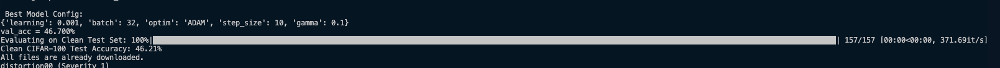
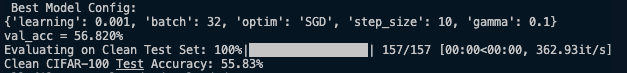
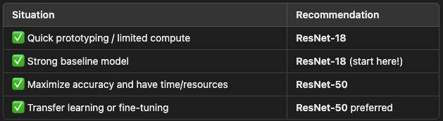

## Overview

This repository contains the code for the midterm challenge of the course DS542 Deep Learning for Data Science.

The challenge is in three parts:
1. **Part 1 -- Simple CNN:** Define a relatively simple CNN model and train it on the CIFAR-100 dataset to
    get a complete pipeline and establish baseline performance.
2. **Part 2 -- More Sophisticated CNN Models:** Use a more sophisticated model, including predefined models from torchvision
   to train and evaluate on CIFAR-100.
3. **Part 3 -- Transfer Learning from a Pretrained Model:** Pretrain a model, or use one of the pretrained models from torchvision, and
   fine-tune it on CIFAR-100. Try to beat the best benchmark performance on the leaderboard.

## Files in Repository

Below is a breakdown of the files included in this repository, grouped by purpose, with descriptions based on their function in the project:

---

### Report & Guidelines

- `assignment_guidelines/` — Contents from the original `README.md` file provided by instructors, transferred here.
- `image-1.png`, `image-2.png`, `image-3.png`, `image-4.png` — Images used in the Assignment Report section of the `README.md`.

---

### Model Scripts

#### Model 1: Simple CNN

- `model_1_epoch_test.py` — Model 1 with different epoch values to determine which one has the best performance.
- `model_1.py` — Simple CNN with the best-performing configuration (epoch value set to 50).

#### Model 2: ResNet-18 (No Pretrained Weights)

- `model_2_hyperparam.py` — Model 2 (ResNet-18 without pretrained weights) running grid search to find the best configuration.
- `model_2_best_param.py` — Model 2 using the best configuration determined from `model_2_hyperparam.py`.

#### Model 3: ResNet-18 (Pretrained)

- `model_3_hyperparam.py` — Model 3 (ResNet-18 pretrained) running grid search to find the best configuration.
- `model_3_best_param.py` — Model 3 using the best configuration determined from `model_3_hyperparam.py`.

---

### Evaluation & Submission Files

- `eval_cifar100.py` — Evaluation code for the clean CIFAR-100 test set.
- `eval_ood.py` — Evaluation code for the out-of-distribution (OOD) test set.
- `submission_ood_model_1.py` — OOD output for Model 1 that was uploaded to Kaggle.
- `submission_ood_model_2.py` — OOD output for Model 2 that was uploaded to Kaggle.
- `submission_ood_model_3.py` — OOD output for Model 3 that was uploaded to Kaggle.
- `sample_submission.csv` — Sample output file for the OOD evaluation.

---

### Utility & Dependencies

- `utils.py` — Utility functions used in the training and evaluation pipeline.
- `requirements.txt` — Requirements needed to run scripts in this repository.

---

### Model Checkpoints

- `best_model.pth` — Saved PyTorch model from the best configuration.

---

### Starter Material

- `starter_code.py` — Starter code provided by instructors for the model framework.

# Assignment Report

## Model Description

### Model 1: Simple CNN
The first model I built was a simple convolutional neural network using PyTorch. Initially, it had only 3 convolutional layers followed by fully connected layers, but this oversimplified version performed poorly - around ~1% accuracy. To improve it, I increased the convolution layers from 3 to 4, added pooling layers and restructured the fully connected layers. These changes significantly improved the model's performance 

Since this was the Simple CNN model, I didn't perform any in-depth hyperparameter tuning. I simply tested different epoch values in `model_1_epoch_test` to explore how different epoch values affected performance. It is well known that more epochs leads to better results, but I simply wanted to see the margins for this specific model. The results showed that after crossing the 15 epoch threshold, the performance gains started to level off. The difference between 15, 25, and 50 epochs was about ~4-5%. In the final file (`model_1`), I trained for 50 epochs (the best performing epoch value tested), used a learning rate of 0.01, and kept the batch dize at 32. This configuration achieved 60.00% accuracy on the local CIFAR-100 test set and scored 0.38938 on the OOD submission when uploaded to Kaggle.

### Model 2: ResNet-50 -> ResNet-18
For the second model, I started with ResNet-50 from `torchvision.models`. I chose ResNet-50 because it was mentioned repeatedly when we were doing our background reading for the final project and it performs particularly well in pattern recognition. I modified the final fully connected layer to output predictions for 100 classes instead of the default 1000. 

Initially, I trained ResNet-50 with heavy data augmentation and ran it for 25 epochs. Locally, the model performed well and got a validation accuracy of ~56%. However, when I submited the OOD CSV file to Kaggle, the performance dropped drastically to about ~6%. I started to read more on ResNet-50 and realized that it needs more epochs to achieve proper results, but when I increased the epochs to 50 the same scenario occured. At this point I decided to swap over to ResNet-18 because it is a much smaller model than ResNet-50. I thought the model's size might've been what was casuing the low performance. 

Unfortunately, switching to ResNet-18 didn't solve my issue either. This is when I decided to consult my peers. They mentioned that they had some performance drop initialy but removing all data augmentation seemed to resolve the problem for them. I followed their instructions and surprisingly that seemed to fix the issues and from that point onwards I stuck with ResNet-18. 

### Model 3: Pretrained ResNet-18
For the third model I continued to use ResNet-18, but this time I used pretrained weight by loading the model with `weights = models.ResNet18_Weights.DEFAULT`. I still replaced the final layer to match the 100-class output for CIFAR-100. As expected this model performed the best due to it already being trained on millions of images.  

---

## Hyperparameter Tuning
I performed hyperparameter tuning specifically on Models 2 and 3. For Model 1, I only explored how different epoch values affected performance in a script called `model_1_epoch_test`. For Models 2 and 3, I performed a grid search over five key hyperparameters:

- **Batch Size**: controls how many samples are processsed at once. Smaller batch sizes are slower but can generalize better. Larger batch sizes are faster but may lead to sharp minima, meaning that the model is less robust.
- **Learning Rate**: Sets the step size during optimization. High learning rates might prevent the model from converging, while smaller learning rates might will make the model run significantly slower. 
- **Optimizer Type**: I tested both SGD (with momentum) and ADAM. SGD tends to have better generalization and ADAM tends to adapt learning rates and converges quickly. 
- **Step Size**: Determines how ferequently the learning rate will decay during training when using the StepLR scheduler. 
- **Gamma**: the decay factor for the learning rate scheduler. Determines how much the learning rate decreases at each step

Each hyperparameter combination was trained for 25 epochs. On the BU SCC, each epoch took between 5-10 seconds. The resource configuration I used for this job was: 
- Cores: 6 
- GPUs: 2 
- Architecture: 8.0 (A100, A40, or L40s)

There were 48 possible combinations in the grid search:  2 batch sizes x 3 learning rates x 2 optimizers x 2 step sizes x 2 gammas = 48 total runs

Each run had 25 epochs and each epoch took 5-10 seconds, resulting in the total run time being between: 

48 x 25 x 5 = 6,000 seconds ≈ 1 hour 40 mins lower bound
48 x 25 x 10 = 12,000 seconds ≈ 3 hours 20 mins upper bound

I chose 25 epochs during tuning because it gave each model configuration enough time to converge and show performance differences without using too much compute time. After identifying the best performing configuration, I then retrained the best model for 50 epochs to give it more time to learn and improve performance further, without risking overfitting. 

While running this tuning process, I removed all data augmentation to avoid possible negative effects on the OOD performance. 

---

## Regularization Techniques
To prevent overfitting and improve generalization, I implemented training-time regregularization techniques direclty in the training loop.

I used the StepLR learing step scheduler. This step gradually reduces the learning rate by a factor of gamma every number of epochs (step_size). BOth of these values were in the hyperparameter grid search to ensure they were tuned effecitvely for each configuration. The core concept of StepLR is that it allowd the model to make larger and faster updates earlier in the training and overtime make smaller and more refined/careful updates as the model converges. This ensure stabilization during the learning process and normally leads to better results. 

Additionally, when SGD was used (either in the gridsearch or the final model) it consisted of a momentum value set to 0.9 (concept derived from Lecture 9). Momentum allows the model to maintain a consistent learning direction when when there are noisy gradients. This helps avoid oscillation and accelerates convergence. 

---

## Data Augmentation Strategy
My data augmentation approach evolved heavily throughout the project and was based on observations, insights from peers, and brute trial and error. 

Initially, I applied quite aggressive data augmentation techniques to the training set such as: Random Cropping, Color Jittering, Random Affine, Random Erasing, as these were common approaches I had seen in other models and suggested by ChatGPT (as mentioned in the AI Disclosure section). The goal was to increase the diversity of the training data and this wouild help the model generalize better by exposing it to more robust inputs. 

Theoretically, this strategy is sound - and in local training it seemed to perform well. Locally these augmentations were averaging performance of ~56% and higher. However, when I submitted the OOD test set on Kaggle these performances dropped drastically to 5-6%. As mentioned in the Model Selection section, I initially thought the issue was related to the model and epochs. This prompted my swap from ResNet-50 to ResNet-18, but this didn't impact the OOD performance either. 

At this point, I reached out ot my classmates, and they had experienced similar issues as I did, but their performance drop off was not as severe. They stated that the data augmentation was what was causing issues on their end. Once they removed all augmentation except for normalization their models started to perform well on the OOD test on Kaggle. I listened to their advice and dropped my data augmentation except for the normalization and surprisingly my performance on Kaggle incresed from 6% to above the benchmark. 

My hypothesis is that the model may have learned to rely on the artifacts that the augmentation introduced rather than learning on a robust input set. Once I established that Data Augmentation was liklely the issue, I removed it from all of the models and then ran the gridsearch for hyperparameter tuning. I wanted to isolate the effects of the hyperparameters without augmentation skewing the results. 

After establishing the best parameters for the models I decided to add back minimal augmentaion which consisted solely of RandomCrop and RandomHorizontalFlip. When I introduced these augmentations back I saw ~4% increase in performance locally throughout all the models and about ~2-3% on the OOD test on Kaggle. This trial and error approach shows that limited augmentation is slightly helpful, while aggressive augementation is very harmful to the process. 

---

## Experiment Tracking Summary
In the starter code provided, `wandb` was included for experiment tracking. However, I started the midterm very late due to exams in other courses and a family emergency after spring break. This series of events left me with only four full days to work on this midterm instead of the full two weeks. Due to the limited time, I had to make some trade offs. 

Initially, I had never used `wandb` before, especially at this scale, so I wasn't sure of what benefits it brought. When I was testing my initial models, I just thought that `wandb` was overloading my terminal and not providing any use. After a while, I made an account and connected it, but I had not yet played with the dashboards so I was still unsure of its value. In the interest of time and code readability, I removed all the `wandb` related code from my scipts and replaced it with basic print statements that would display the hyperparameter combination and the validation accuracy... old school style. 

I wrote the script so that once the grid search would complete, it would automatically use the best performing model, and use it to evaluate on both CIFAR-100 test set and the OOD set. Only after finishing the modeling and hyperparameter tuning did I take the time to play around with the `wandb` dashboard and realize how powerful of a tool it actualy is. The time constraint and initial learning curve were the main reasons I decided to drop it, but going forward I will definitely be using it in future projects. For this midterm, I had to stick to what I was most comfortable with and keep the process simple and efficient. 

As for screenshots, I only took two of them, because all configurations and validations scores were already printing out in the terminal. I just saved the best ones to reference quickly while writing the final scripts.

  

---

## Performance Summary

I tracked results manually across two stages: early testing and final tuned training. Here are the results:

### No Data Augmentation and No Hyperparameter Tuning (Epoch = 5)

| Model   | Accuracy (Local Test) |
|---------|------------------------|
| Model 1 | 39.25%                |
| Model 2 | 31.00%                |
| Model 3 | 26.00%                |

These runs were quick and meant for debugging and basic comparison.

---

### Minimal Data Augmentation and Hyperparameter Tuning

| Model   | Accuracy (Local Test) | Kaggle OOD Score |
|---------|------------------------|------------------|
| Model 1 | 60.00%                | 0.38938          |
| Model 2 | 50.33%                | 0.39811          |
| Model 3 | 60.41%                | 0.44835          |

This second phase used tuned hyperparameters and minimal augmentation (`RandomCrop` + `RandomHorizontalFlip`). Model 3, which used pretrained ResNet-18, ended up performing the best both locally and on Kaggle.

---

## AI Disclosure

Throughout this assignment I tried to use ChatGPT as minimally as I could to ensure that I was making most of this learning opportunity. The prompts that I asked ChatGPT are listed below, along with my reasoning for asking these prompts and how they were used throughout the code. 

**Prompt 1:** "I am working on a CNN model that is going to be trained on CIFAR-100, what are some common data augmentation techniques that are used in this scenario and what does each of them do?"  
**Answer:** The answer ChatGPT provided consisted of 7 techniques (Random Horizontal Flip, Random Rotation, Color Jitter, Random Crop with Padding, Random Affine Transformations, Cutout/Random Erasing, Normalize), what each of them does and why each of them is used along with a one line python code example of what each technique looks like in practice.  
**Reason for Asking:** There are many online examples of code repositories using these techniques, but none of them really explained what each technique does and why they are used. ChatGPT provided the answer to these questions and gave a one line example for each.  
**Use in Code:** the lines that were used from ChatGPT are explicility commented in the scripts themselves.

**Prompt 2:** "What are the Pros and Cons of ResNet-50 vs ResNet-18 for training on CIFAR-100"  
**Answer:**  
  
**Reason for Asking:** I asked this question when I was having the issue of good local performance and terrible performance on the OOD test. I suspected that ResNet-50 might be too big of a model and causing the issue with the performance drop so I thought of switching to a smaller model like ResNet-18. I wanted some more insights into whether ResNet-18 would be a better fit and ChatGPT's answer was the final push to switch over.  

**Prompt 3:** "My model performs well locally on a clean CIFAR-100 test, but when I run an OOD test and upload an OOD File to Kaggle the performance drops by 50%. Is this possibly due to data augmentation?"  
**Answer:** Yes, a sharp drop in OOD (out-of-distribution) test performance, especially when your model performs well on the clean CIFAR-100 test set, can absolutely be caused by certain types of data augmentation — or rather, a mismatch between your training-time assumptions and the distribution of the OOD data.  
**Reason for Asking:** This is when I was having the issue with good performance locally and significant performance drop off on Kaggle. My peers had hinted that this could possibly be due to the data augmentation I was doing, and I needed a second opinion on this, so I asked ChatGPT.  

**Prompt 4:** "When running manual hyperparameter tuning (gridsearch) on a CNN, what are some variables that make sense to tune?"  
**Answer:** Learning Rate, Optimizer, Batch Size, Weight Decay, Momentum for SGD, Number of Epochs, Learning Scheduler Rate, and Data Augmentation.  
**Reason for Asking:** I have done manual hyperparameter tuning via gridserarch in the past and it is the method I am most comfortable with which is why I opted to do this approach in the scripts. Given the limited time I had to complete the midterm, I wanted to make sure I was focusing on the right hyperparameters to tune. Initially, before asking Chat I was considering Optimizer Type, Batch Size, and Learning Rate, but from ChatGPT's answer I took number of epochs (and ran that solely for model 1) and Learning Scheduler Rate (specigically step_size and gamma). I would have liked to integrate Data Augmentation, but given the issues Data Augmentation had caused earlier and the increase in training time Data Augmentation would cause I decided to omit this option.

**Prompt 5:** "Can you help me properly format my README.md file"
**Answer:** The format of this file
**Reason for Asking:** I wrote everything in this file myself (except for the Overview blurb from the original README), I just needed assistance in being able to format everything properly.